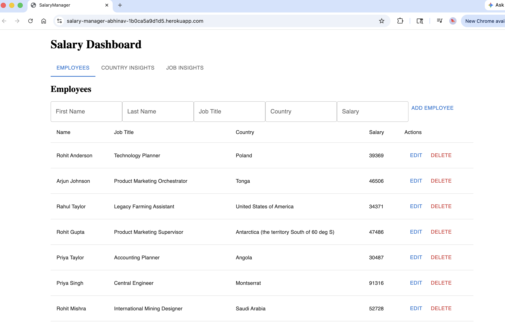
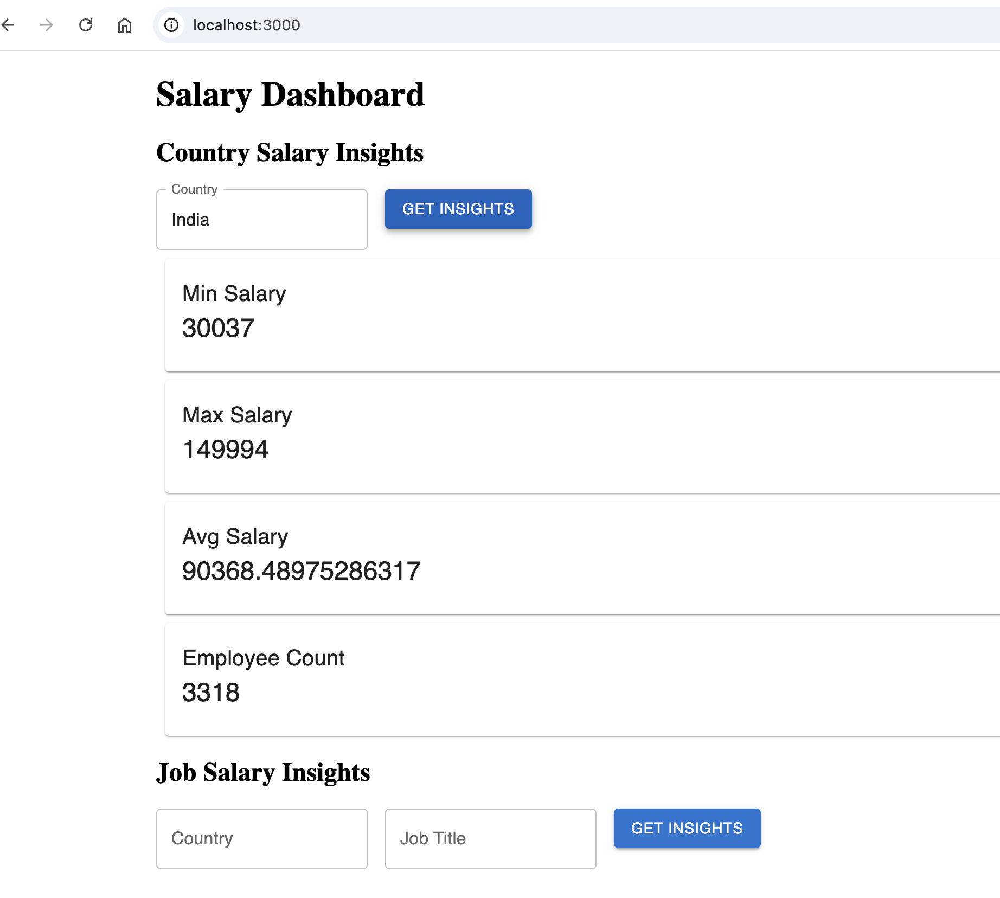
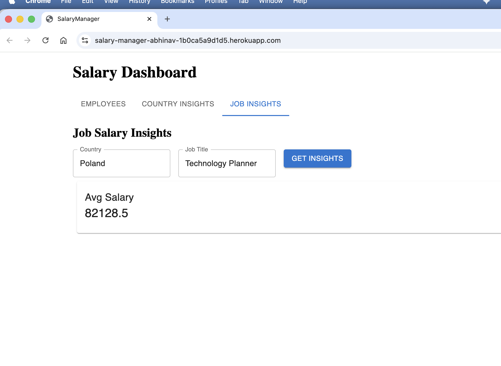

# 💼 Salary Manager – Full Stack Application

A minimal yet scalable salary management system built for an organization with 10,000 employees.
This application allows HR managers to manage employees and gain salary insights through an interactive UI.

---

## 🚀 Features

### 👥 Employee Management

* Add, view, update, and delete employees
* Fields:

  * Full Name
  * Job Title
  * Country
  * Salary

---

### 📊 Salary Insights

* Minimum, Maximum, Average salary by country
* Average salary by Job Title within a country
* Employee count per country

---

### 🎨 Frontend (React)

* Built using React inside Rails
* Material UI for clean UI components
* API-driven insights dashboard

---

## 🏗️ Tech Stack

### Backend

* Ruby on Rails 8 (API mode)
* SQLite (can be replaced with PostgreSQL)
* RSpec for testing

### Frontend

* React (integrated using esbuild)
* Material UI (MUI)
* Axios (API calls)

### Tooling

* jsbundling-rails (esbuild)
* Node.js (v18+ recommended)
* npm

---

## 🧠 Architecture Overview

* Rails API handles:

  * Employee CRUD
  * Salary Insights APIs
* React UI consumes APIs
* esbuild bundles frontend assets
* Static assets served via Rails API configuration

---

## ⚙️ Setup Instructions

### 1️⃣ Clone Repository

```bash
git clone <repo-url>
cd salary_manager
```

---

### 2️⃣ Install Dependencies

#### Backend

```bash
bundle install
```

#### Frontend

```bash
npm install
```

---

### 3️⃣ Setup Database

```bash
rails db:create
rails db:migrate
```

---

### 4️⃣ Seed Data (10,000 Employees)

```bash
rails db:seed
```

👉 Generates employee names using:

* `first_names.txt`
* `last_names.txt`

---

### 5️⃣ Run Application

```bash
./bin/dev
```

App will be available at:

```
http://localhost:3000
```

---

## 🧪 Running Tests

```bash
bundle exec rspec
```

✔ Includes:

* Model tests
* Controller tests
* Edge case validations

---

## 📡 API Endpoints

### Get Country Insights

```
GET /insights/country?country=India
```

Response:

```json
{
  "min": 30000,
  "max": 120000,
  "avg": 65000,
  "count": 2500
}
```

---

### Get Job Insights

```
GET /insights/job?country=India&job_title=Engineer
```

Response:

```json
{
  "avg": 75000
}
```

---

## 🧪 Edge Cases Handled

* No employees found
* Invalid or missing parameters
* Empty dataset handling
* API error handling in UI

---

## ⚡ Performance Considerations

* Efficient ActiveRecord queries using:

  * `minimum`
  * `maximum`
  * `average`
  * `count`
* Seed script optimized for bulk inserts
* Designed to scale for 10,000+ employees

---

## 🧠 Engineering Artifacts

- Planning Notes: docs/planning.md
- Architecture: docs/architecture.md
- AI Usage: docs/ai_usage.md


---

## 🧩 Trade-offs & Decisions

* Used Rails API mode for lightweight backend
* Integrated React inside Rails instead of separate app for simplicity
* Used SQLite for quick setup (can be swapped with PostgreSQL)

---

## 🛠️ Known Improvements (Future Scope)

* Authentication (HR login)
* Advanced analytics (percentiles, trends)
* Export reports (CSV/PDF)

---

## 🚀 Live Demo

🌐 Application URL: https://salary-manager-abhinav-1b0ca5a9d1d5.herokuapp.com/

## 🎥 Video Demo

📺 Watch Demo: https://drive.google.com/file/d/1XRzQF_pNX-CzHJB33_GhaW0n9Q1ZomF3/view

---

## 📸 Screenshots

### 🏠 Dashboard


### 🌍 Country Salary Insights


### 💼 Job Salary Insights


---

## 👨‍💻 Author

Abhinav Mishra

---
